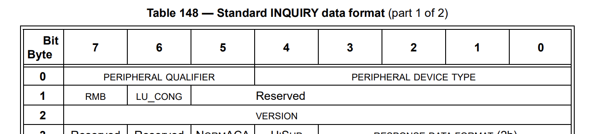

# STRUCTure EXtensions
`structex` provides annotation rules that extend Go structures for implementation of encoding and decoding of byte backed data frames.

`structex` aims to make it easier to represent industry standard data formats that can be directly embedded in code.

## Example
Given the first three bytes T10 SCSI Primary Commands definition of a SCSI INQUIRY data


A `structex` annotated struct type declaration might be

```go
package main

import (
    "fmt"

    "github.com/HewlettPackard/structex"
)

type SCSI_Standard_Inquiry struct {
    PeripheralDeviceType uint8 `bitfield:"5"`          // Byte 0
    PeripheralQualifier  uint8 `bitfield:"3"`
    reserved0            uint8 `bitfield:"6,reserved"` // Byte 1
    LU_Cong              uint8 `bitfield:"1"`
    RMB                  uint8 `bitfield:"1"`
    Version              uint8                         // Byte 2
}

func main() {
    var inquiry = new(SCSI_Standard_Inquiry)

    // Perform IOCTL on device, returns byte reader to byte response

    if err := structex.Decode(byteReader, inquiry); err != nil {
        panic("a problem")
    }

    fmt.Printf("SCSI Peripheral Device Type: %d\n", inquiry.PeripheralDeviceType)
    fmt.Printf("SCSI Peripheral Qualifier: %d\n", inquiry.PeripheralQualifier)
    fmt.Printf("Inquiry Version: %#02x\n", inquiry.Version)
    // etc
}
```
## Annotation Format

### Bitfield

Bitfields define a structure field with an explicit size in bits. They are analogous to bit fields in the C specification.

`bitfield:"[size][,reserved]"`

    `size`:     Specifies the size, in bits, of the field.

    `reserved`: Optional modifier that specifies the field contains reserved
                bits and should be encoded as zeros.

### Self-Described Layout

Many industry standards support dynamically sized return fields where the data layout is self described by other fields. To support such formats two annotations are provided.

`sizeof:"[name][,relative]"`

    name        Specifies that the field describes the size of `name` within the
                structure. Should be used with slices.

                During decoding, if field is non-zero, the field's value is
                used to limit the number elements in the array or slice of
                name `name`.

    relative    Optional modifier that specifies the value describing the size of
                `name` is relative to the field offset within the structure.
                This is often used in T10.org documentation

`countof:"[name]"`

    name        Specifies that the value describes the count of elements in
                the `name` field.

                During decoding, if field is non-zero, the field's value is
                used to limit the number elements in the array or slice of
                name `name`.

### Truncation
Structex expects sufficient data for decoding the desired structure. When data structures are used to define a maximum size of the response buffer, you can use the `truncate` tag on an arry or slice to permit structex to truncate the returned data with what is provided by the source
buffer. If truncate is not specified and the provided buffer is of smaller size than the data structure, an `io.EOF` error is expected.

`truncate:""`


### Alignment (Not Yet Implemented)

Annotations can specified the byte-alignment requirement for structure fields. Analogous to the alignas specifier in C. Can only be applied to non-bitfield structure fields.

`align:"[value]"`

    value       An integer value specifying the byte alignment of the field.
                Invalid non-zero alignments panic.

## Full Tags

The tags documented above are abbreviated for ease of use; if desired, the full tag format is supported. This provides clarity that tags are part of the `structex` package, but it means typing more and using every sort of quote and backtic at your disposal.

Examples

```
`structex:"bitfield='3'"`
`structex:"bitfield='3,reserved'"`
`structex:"countOf='D'"`
`structex:"sizeOf='E'"`
`structex:"sizeOf='F,relative'"`
`structex:"align='8'"`
`structex:"truncate"`
```

## Performance
`structex` places code and structure definition readability ahead of any pack/unpack performance. In brief, performance is abysmal.
 
For those looking for more performant code, consider [code generation](https://github.com/golang/text/blob/master/internal/gen/bitfield/bitfield.go) or a [cache based](https://github.com/lunixbochs/struc) solutions 

